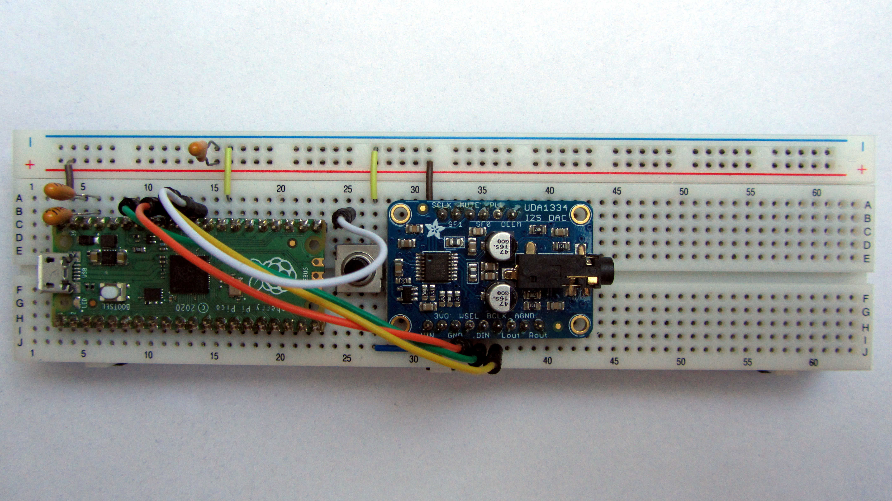

# pico-simple-stupid-synth

This repository contains the code for a Raspberry Pico RP2040 based
very simple polyphonic synthesizer.  The Pico will appear as a
USB-MIDI device on any USB host computer that supports MIDI over USB.

## Software Features

The synthesizer only supports a clean square shape as sole wave form,
since this is the simplest and fastest wave form to synthesize.  But
it can do this for roughly 32 polyphonic voices in parallel.
Actually, the exact limit of voices varies with environment properties
such as the overall traffic on the MIDI lines and other.  Also, lots
of high pitches will produce slightly more MCU load than low pitches.

## Connecting to a USB Host

MIDI data is transferred via USB.  That is, just connect the Pico with
your PC or notebook via USB, and the Pico, when programmed as
synthesizer, will appear as a USB-MIDI device named _Pico Simple
Stupid Synth_.  You can play any MIDI files, using your favorite MIDI
player, just by selecting this MIDI device.

## Connecting to an Audio Output Device

The synthesizer outputs its generated audio as digital stereo signal
via an I²S interface (not to be confused with I²C) with 16 bits sample
size and a sample frequency of 48kHz.  Specifically,

* the I²S BLCK clock signal is provided at GPIO 26 (pin 31),
* the I²S LRCLK word signal is provided at GPIO 27 (pin 32), and
* the I²S data signal is provided at GPIO 28 (pin 34).

To hear the sound, you will need to connect an I²S audio device to
these pins.  Check out for some I²S audio amplifier breakout or board
or any device that features an I²S input.  As an example, Fig. 1 shows
an I²S audio device connected to the Pico.

<figure style="display: block; margin: 0 auto">
  <a href="docs/images/assembly-on-breadboard.jpg">
    
  </a>
  <figcaption>
    <em>Fig. 1: Assembly on Breadboard with I²S Audio Converter</em>
  </figcaption>
</figure>

If you are planning to build an I²S amplifier by your own, you may
want to have a look at Sect. 3.4.2 “PCM/I2S audio” of the book
“Hardware design with RP2040” published by Raspberry Pi Ltd, available
at <a
href="https://datasheets.raspberrypi.com/rp2040/hardware-design-with-rp2040.pdf">here</a>,
that presents a schematic diagram for a complete digitial I²S PCM
audio circuit (though note that in the schematics, the assumed order
of the GPIO pin numbers differs from our wiring).

## Compiling

It is highly recommended to compile the project on a Raspberry Pi
computer.  Compiling _should_ also work on any other Linux machine or
maybe even under Windows, but I have not verified that.

The build files assume that the files of this repository are located
side by side with the Pico SDK as provided by Raspberry Pi Ltd.  See
<a
href="https://www.raspberrypi.com/documentation/microcontrollers/c_sdk.html">The
C/C++ SDK</a> for instruction how to install the SDK.  The probably
easiest way to install the SDK on a Raspberry Pi is to use the setup
script that is mentioned in Section _SDK Setup_.

Assuming you have installed the Pico SDK in your home directory
<code>~/pico</code>, the directory layout structure should look as
follows:

```
├── ~/pico
|   ├── openocd
|   ├── pico-examples
|   ├── pico-extras
|   ├── pico-playground
|   ├── picoprobe
|   ├── pico-sdk
|   ├── pico-simple-stupid-synth
```

Ensure you have version 1.5 of the Pico SDK or higher.  Earlier
releases of the Pico SDK include a version of the TinyUSB library that
is likely not to work.

For compiling, run the script <a
href="build.sh"><code>build.sh</code></a> from within the
<code>pico-simple-stupid-synth</code> directory.

## Deploying

After successful compiling, you should find the file
<code>~/pico/pico-simple-stupid-synth/build/simple-stupid-synth.elf</code>.
While pressing the <code>BOOTSEL</code> button on your pico, connect
it via USB to your computer.  You should now see a new (pseudo) file
system, usually called <code>RPI-RP2</code>.  If the file system does
not automatically appear, you may need to manually mount it (it will
usually be accessible under the <code>/dev/sda1</code> device file, of
course unless you have already some other device that has already
grabbed this name).

To deploy, just copy the compiled file
<code>~/pico/pico-simple-stupid-synth/build/simple-stupid-synth.elf</code>
onto the Pico file system.  The file system should then automatically
disappear again, and the synthesizer immediately starts.

There is the script <a href="deploy.sh"><code>deploy.sh</code></a>
that tries to detect device path and mount path of the connected Pico.
Just execute this script after connecting your Pico for deploying the
compiled file.  The script <em>should</em> work for any Debian-like
distribution, but it has not been tested widely, so chances are high
that it will not work in a less typical configuration environment.  In
this case, try to deploy manually as described above.

## Running

The Pico should now appear as a MIDI device named _Pico Simple Stupid
Synth_ (if not, try disconnecting and reconnecting your USB cable).
You can play any MIDI files, using your favorite MIDI player, just by
selecting this MIDI device as MIDI ouput device in your MIDI player.

## Known Issues

The code is _prepared_ to also use PWM audio instead of I²S audio,
such that an amplifier or high-impedance headphones can be connected
just via a resistance to the PWM outputs.  However, due to various
bugs / limitations, PWM audio does not yet work:

* PWM _stereo_ audio does not seem to work at all.  Even the
  <code>sound_wave.c</code> example in the
  <code>pico-playground</code>, when modified to produce stereo output
  with identical left and right channel samples, will get stuck
  shortly after calling <code>audio_pwm_set_enabled</code> and clog
  the complete system.

* PWM mono audio _basically_ works (as the <code>sound_wave.c</code>
  example demonstrates), but stops producing any output on the
  associated GPIO pin, as soon as the TinyUSB library is set up for
  creating a MIDI USB port.

* While I²S audio presumably works for a wide range of sample
  frequencies, according to my observation PWM mono audio behaves as
  if it was stuck at a fixed sample rate of around 57000 Hz.  In
  contrast to I²S audio, the frequency parameter that is set in the
  <code>audio_format</code> structure does not seem to have any
  influence on the sample rate of PWM audio.

* Also note that the implementation of PWM audio in
  <code>audio_pwm.c</code> launches MCU core 1 to initiate DMA
  transfers.  That is, if any other part of the software also tries to
  deploy core 1, a clash will occur, if no further provisions are
  taken.  Maybe a clash like this is somehow related to the reason why
  PWM mono does not work any more as soon as setting up a MIDI port
  with the TinyUSB library?

## License &amp; Third-Party Code

The source code of the Pico Simple Stupid Synth is available under the
conditions of the GNU General Public Licence Version 2.  Note that
this repository additionally contains files <code>tusb_config.h</code>
and <code>usb_descriptors.c</code> based on third-party code,
copyrighted by Ha Thach (tinyusb.org), licensed under the MIT License.
The files <code>pico_extras_import.cmake</code> and
<code>pico_sdk_import.cmake</code> are copied from the Pico SDK and
are copyrighted by Raspberry Pi (Trading) Ltd.
